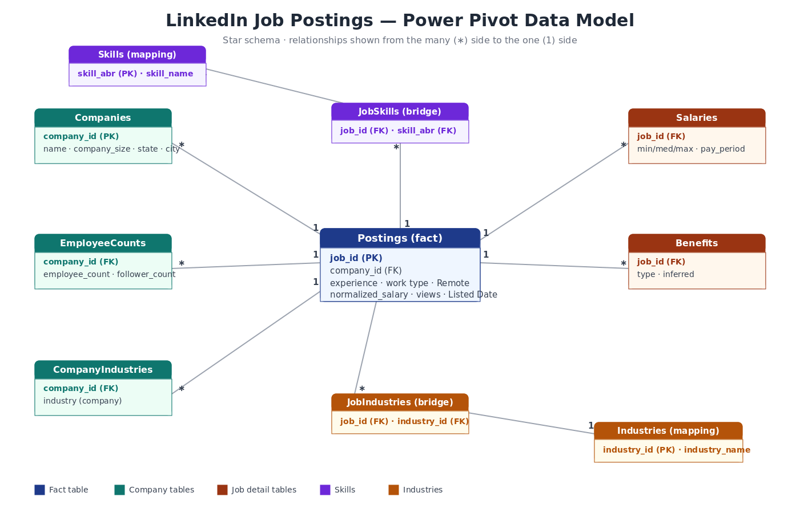

# US Job Market Dashboard — LinkedIn Postings (Mar–Apr 2024)

An interactive Excel dashboard analysing **123,849 LinkedIn job postings** across the United States (24 Mar – 19 Apr 2024), built on a **Power Pivot data model** with **DAX** measures.


> Replace the image above with a screenshot of your finished dashboard saved to `images/dashboard_preview.png`.

## Data model
Ten related tables joined into a star-style schema in Power Pivot:



## What it shows
- Demand by **experience level**, **work type**, **location/state**, **industry** and **skill**
- **Median salary** by experience level
- **Remote vs on-site** share, **top hiring companies**, and engagement (**views**)

## Excel skills demonstrated
- **Power Query** — load 10 related tables (Connection-only + Add to Data Model), convert epoch-millisecond dates, fix blank `remote_allowed`/experience/company fields, and flag salary outliers without deleting rows
- **Power Pivot & DAX** — eight relationships; measures for `Median Salary`, `Distinct Companies`, `Remote %`, `Avg Views`
- **PivotTables & PivotCharts** — eight model-driven analytical views
- **Interactivity** — slicers (work type, experience, remote, state) + a Timeline wired to every pivot
- **Formulas & formatting** — XLOOKUP, SUMIFS/COUNTIFS, distinct-count via SUMPRODUCT, data bars, colour scales

## Repository structure
```
LinkedIn-Jobs-Dashboard/
├── data/                              # dataset (subfolders preserved)
│   ├── postings.csv                   # NOT committed — 491 MB, see note below
│   ├── jobs/ (skills, industries, salaries, benefits)
│   ├── companies/ (companies, employee_counts, company_industries)
│   └── mappings/ (skills, industries)
├── dashboard/
│   └── LinkedIn_Jobs_Dashboard.xlsx
├── images/
│   ├── dashboard_preview.png
│   └── data_model.png
├── README.md
└── .gitignore
```

## How to use
1. Download `dashboard/LinkedIn_Jobs_Dashboard.xlsx`.
2. Open in **Excel (desktop, 2016 or newer)** with **Power Pivot enabled** (File ▸ Options ▸ Add-ins ▸ COM Add-ins ▸ Microsoft Power Pivot for Excel).
3. Use the **slicers** and **timeline** to filter interactively.
4. **Data ▸ Refresh All** rebuilds the whole dashboard from the Power Query pipeline.

> The dashboard opens with data pre-loaded — no action needed. Refreshing requires the full `postings.csv` (see Data section) at the same relative path.

## Data
LinkedIn Job Postings, United States, 24 Mar – 19 Apr 2024.
> `data/postings.csv` (~491 MB) exceeds GitHub's 100 MB file limit and is **not committed** — download the raw file from the original source and place it in `data/`, or commit a sampled `postings_sample.csv`. For portfolio/demonstration use only.

## About this project
This is the **Excel** piece of a broader data portfolio. **SQL** and **Python** projects using the same relational dataset are on the way.

**Author:** Sangram — [LinkedIn](www.linkedin.com/in/sangram-bharat-associate-analyst) · [GitHub](https://github.com/sangrambharatjobs)
